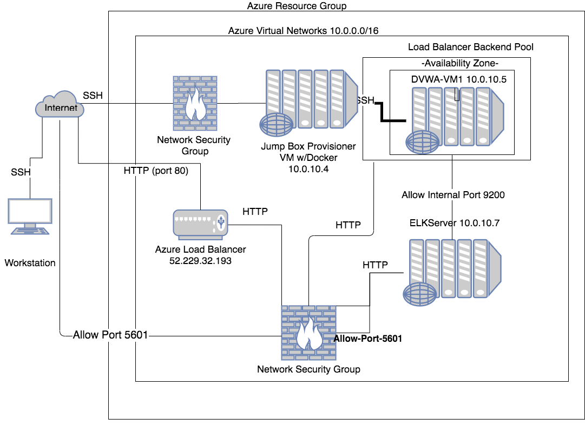

# Cybersecurity-Projects
# Author : SM
# Project Name:  Automated Elk Stack Deployment
# Date : 08-Jun-2020
## Automated ELK Stack Deployment

The files in this repository were used to configure the network depicted below.

  

These files have been tested and used to generate a live ELK deployment on Azure. They can be used to either recreate the entire deployment pictured above. Alternatively, select portions of the PLAYBOOK file may be used to install only certain pieces of it, such as Filebeat.

  - [filebeat-playbook.yml](Ansible/filebeat-playbook.yml)

This document contains the following details:
- Description of the Topology
- Access Policies
- ELK Configuration
  - Beats in Use
  - Machines Being Monitored
- How to Use the Ansible Build

### Description of the Topology

The main purpose of this network is to expose a load-balanced and monitored instance of DVWA, the D*mn Vulnerable Web Application.

Load balancing ensures that the application will be highly available, in addition to restricting traffic to the network.
- What aspect of security do load balancers protect? Protects the availability
- What is the advantage of a jump box? Jump Box serves as a gateway router and serves as a single node by securing and monitoring traffic   called FANNING IN. 

Integrating an ELK server allows users to easily monitor the vulnerable VMs for changes to the logfiles and system metrics.
- What does Filebeat watch for? Log files 
- What does Metricbeat record? System Metrics

The configuration details of each machine may be found below.

| Name     | Function | IP Address | Operating System |
|----------|----------|------------|------------------|
| Jump Box | Gateway  | 10.0.10.4  | Linux            |
| DVWA-VM1 | WebServer| 10.0.10.5  | Linux            |
| ELK      | Elkserver| 10.0.10.7  | Linux            |

### Access Policies

The machines on the internal network are not exposed to the public Internet. 

Only the LoadBalancer machine can accept connections from the Internet. Access to this machine is only allowed from the following IP addresses:
<insert user's public IP address here>

Machines within the network can only be accessed by Jump Box.
- Which machine did you allow to access your ELK VM? Jump Box
  What was its IP address? 10.0.10.4

A summary of the access policies in place can be found in the table below.

| Name     | Publicly Accessible | Allowed IP Addresses |
|----------|---------------------|----------------------|
| Jump Box | Yes/No              | Host Machine.        |

### Elk Configuration

Ansible was used to automate configuration of the ELK machine. No configuration was performed manually, which is advantageous because
we can rerun the script over and over again thus ensuring consistancy and thus automating this process.
- What is the main advantage of automating configuration with Ansible? we can rerun the configuration as many times as needed.

The playbook implements the following tasks:
- Increase Virtual Memory
- Install Docker
- Install Pip
- Use Pip Module
- Download and Launch Elk Container

The following screenshot displays the result of running `docker ps` after successfully configuring the ELK instance.

[docker_ps_output.png](Ansible/docker_ps_output.png)

### Target Machines & Beats
This ELK server is configured to monitor the following machines:
- DVWA-VM1 - 10.0.10.5

We have installed the following Beats on these machines:
- filebeats

These Beats allow us to collect the following information from each machine:
- Filebeat was collecting the system logs from DVWA-VM1 machine.

### Using the Playbook
In order to use the playbook, you will need to have an Ansible control node already configured. Assuming you have such a control node provisioned: 

SSH into the control node and follow the steps below:
- Copy the /files/[filebeat-configuration.yml](Ansible/filebeat-configuration.yml) file to ../filebeat/filebeat.yml file.
- Update the /etc/ansible/[hosts](Ansible/hosts) file to include ports
- Run the playbook, and navigate to <ElkserverIP>:5601 to check that the installation worked as expected.

_Answer the following questions to fill in the blanks:_
- _Which file is the playbook? filebeat-playbook.yml Where do you copy it? /roles/filebeat.yml
- _Which file do you update to make Ansible run the playbook on a specific machine? /etc/ansible/hosts
- _How do I specify which machine to install the ELK server on versus which to install Filebeat on? hosts: elkserver
- _Which URL do you navigate to in order to check that the ELK server is running? <ElkserverIP>:5601
  
Bonus
=====

(a) Start your Jumbox on MS Azure

(b) Start your DVWA-VM1 and ElkServer Virtual machines

(c) Login to the Jumpbox Server 

(d) Do the following steps if your logging in for the first time, if not skip to step (e)

    -Register yourself as a docker user at https://hub.docker.com/
    
    -sudo apt-get update
    
    -sudo apt-get install docker-io
    
    -sudo docker pull <docker registered username>/<password>
    
    -sudo docker run -ti <docker registered username>/ <password> bash
    
(e) Select any docker names listed by running this command , sudo docker container list -a

(f) sudo docker start docker-container-name-from-above

(g) sudo docker attach docker-container-name-from-above

(h) Clone the repository from github if you running this playbook for the first time. 
    If not skip step (h) and goto step(i) to get the latest version of the playbook.
    
         - git clone https://github.com/smadapusi/Cybersecurity-Projects.git
         
         - git pull

    
(i) To Download the latest version of playbook in git from the Ansible folder 

     Run this command from your local ansible folder , git pull filebeat-playbook.yml
     
(j) To Update the playbook , you can either use text editors like "vi" or "nano". For example $vi filebeat-playbook.xml

(k) To Run the playbook from inside the ansible container , use ansible-playbook <plabybook filename> like this 
  
       $ansible-playbook filebeat-playbook.xml
         
